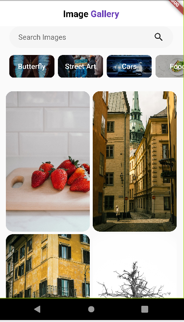
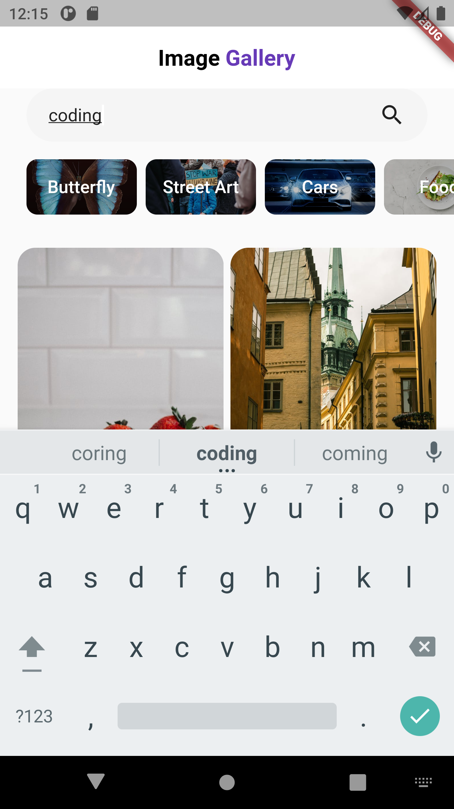
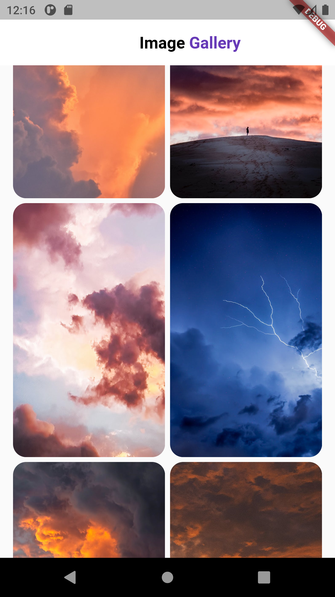

# ImageGallery

A new Flutter project.

## Getting Started

This project is a small Flutter application that uses pexel api to fetch images, lets the user search and save various images.

A few screenshots to the application :

 

 

 
